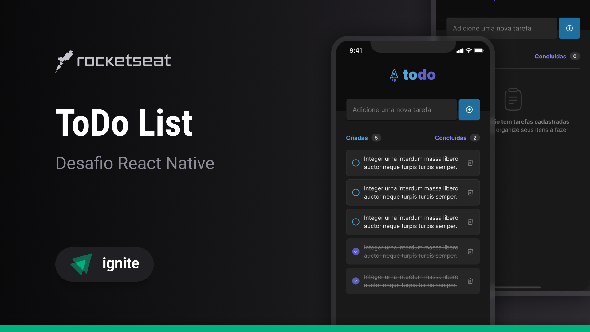

# 📱 Desafio 01: Fundamentos do React Native - To-Do List



## 💻 Sobre o desafio

Nesse desafio, você vai desenvolver uma aplicação de controle de tarefas no estilo **to-do list**, que contém as seguintes funcionalidades:

✓ Adicionar uma nova tarefa <br/>
✓ Marcar e desmarcar uma tarefa como concluída <br/>
✓ Remover uma tarefa da listagem <br/>
✓ Mostrar o progresso de conclusão das tarefas <br/>

Esse desafio ajuda a relembrar conceitos como:

- Estados
- Imutabilidade do estado
- Listas e chaves no React Native
- Propriedades
- Componentização

## 🚀 Tecnologias

- React Native
- Expo
- TypeScript

## 📝 Instruções

1. Clone este repositório
```bash 
git clone https://github.com/fellipebastos/ignite-rn-desafio1.git
```

2. Acesse a pasta do projeto no terminal
```bash
cd ignite-rn-desafio1
```

3. Instale as dependências
```bash
npm install
```

4. Execute a aplicação no sistema iOS ou Android
```bash
npm run ios
```
ou
```bash
npm run android
```

## 🔗 Links

- [Figma Layout](https://www.figma.com/design/1NfQMOgUpMn99PrsQsxdau/ToDo-List-%E2%80%A2-Desafio-React-Native-(Copy)?m=auto&t=etci52eGMS4CdmPk-6)